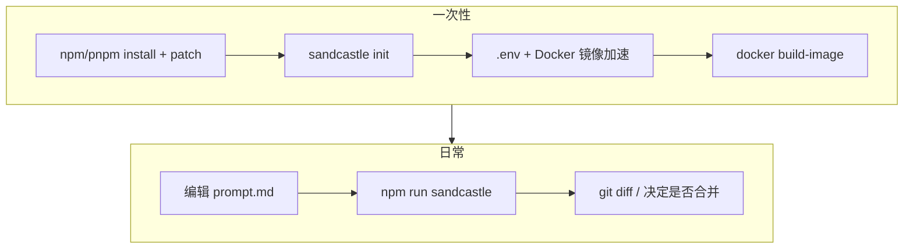

# Sandcastle 使用指南

本文档说明 [Sandcastle](https://github.com/mattpocock/sandcastle) 的核心概念与 API，并记录 **sandcastle-learning** 仓库在 macOS + Docker 环境下的实践（含镜像加速、macOS GID 修复）。

## 概述

Sandcastle 是一个用于编排 AI 编程智能体 (Agent) 的 TypeScript 库。它通过 Git worktree 和沙箱 (Sandbox) 在隔离环境中运行 Agent、编写代码，再将变更合并回主分支。

```
宿主机 Git 仓库
    │
    ├─ worktree（Agent 工作区，与主目录隔离）
    │
    └─ Docker 沙箱（可选）
           └─ 容器内运行 opencode / claude-code 等 CLI
```

## 核心概念

| 概念 | 说明 |
|------|------|
| **Agent Provider** | AI Agent 提供商：`claudeCode`、`opencode`、`codex`、`pi` |
| **Sandbox Provider** | 隔离执行环境：`docker`、`podman`、`vercel` 等 |
| **Branch Strategy** | 控制 Agent 在哪个分支上工作 |
| **Worktree** | Git worktree，Agent 的独立工作目录 |
| **Prompt** | 描述任务的 Markdown 文件（如 `.sandcastle/prompt.md`） |

## 环境要求

| 依赖 | 说明 |
|------|------|
| **Node.js** | >= 18（本仓库使用 ESM：`"type": "module"`） |
| **Git** | worktree 隔离依赖 Git |
| **Docker Desktop** | 使用 Docker 沙箱时（macOS 最常见） |
| **API Key** | 按 Agent 类型配置（见 `.sandcastle/.env.example`） |

可选：`pnpm` / `npm` 均可；本仓库含 `patches/`，安装后需执行 `postinstall`（`patch-package`）。

---

## 本仓库快速开始

适用于已 clone **sandcastle-learning**、使用 **OpenCode + Docker + blank 模板** 的场景。

### 一次性准备

```bash
# 1. 安装依赖（自动应用 patches/@ai-hero+sandcastle+0.5.10.patch）
pnpm install   # 或 npm install

# 2. 配置 API Key
cp .sandcastle/.env.example .sandcastle/.env
# 编辑 .sandcastle/.env，填入 OPENCODE_API_KEY

# 3. 构建 Docker 沙箱镜像（首次或修改 Dockerfile 后）
pnpm run sandcastle:build

# 4. （可选）配置 Docker Hub 镜像加速，见下文「Docker 镜像加速」
```

### 日常开发

```bash
# 1. 编辑任务描述
#    .sandcastle/prompt.md

# 2. 运行 Agent
pnpm run sandcastle    # 等价于 npx tsx .sandcastle/main.ts
```

### 本仓库 npm scripts

| 命令 | 作用 |
|------|------|
| `pnpm run sandcastle` | 在 Docker 沙箱中执行 Agent |
| `pnpm run sandcastle:build` | 构建 Docker 镜像（改 Dockerfile 后执行） |
| `pnpm run sandcastle:init` | 重新脚手架 `.sandcastle/`（**已有目录时会失败**，一般只需一次） |
| `postinstall` | 自动 `patch-package`，修补 macOS GID 问题 |

当前编排入口：`.sandcastle/main.ts`（OpenCode + Docker + `prompt.md`）。

---

## 通用快速开始（新项目）

### 1. 初始化 Node 项目

```bash
mkdir my-sandcastle-project && cd my-sandcastle-project
npm init -y
```

在 `package.json` 中添加 `"type": "module"`。

### 2. 安装 Sandcastle

```bash
npm install --save-dev @ai-hero/sandcastle tsx
```

### 3. 运行 `sandcastle init`

**交互式（向导）：**

```bash
npx sandcastle init
```

**非交互（预填 Agent / 模型 / 模板）：**

```bash
npx sandcastle init \
  --agent opencode \
  --model deepseek/deepseek-v4-flash \
  --template blank
```

仍会交互询问：

| 步骤 | 建议（blank + Docker 学习） |
|------|---------------------------|
| Sandbox provider | **Docker** |
| Backlog manager | 不用 GitHub Issues 可选 **Beads**（Dockerfile 更精简）；需要 `gh` 选 GitHub Issues |
| 创建 Sandcastle label | **No**（blank 用不到） |
| 立即 build 镜像 | **No**（先配镜像加速 / macOS patch，再手动 build） |

生成的 `.sandcastle/` 结构：

```
.sandcastle/
├── Dockerfile        # 沙箱环境（Docker/Podman）
├── prompt.md         # Agent 任务
├── .env.example      # 环境变量模板
├── .gitignore
├── main.ts           # 编排脚本
└── logs/             # 运行日志（执行后产生）
```

### 4. 配置环境变量

```bash
cp .sandcastle/.env.example .sandcastle/.env
```

```env
# OpenCode
OPENCODE_API_KEY=sk-xxx

# Claude Code
ANTHROPIC_API_KEY=sk-ant-xxx

# Codex
OPENAI_KEY=sk-xxx
```

### 5. 构建沙箱镜像（Docker）

```bash
npx sandcastle docker build-image
```

等价于：

```bash
docker build -t sandcastle:<项目目录名> -f .sandcastle/Dockerfile .
```

`build-image` 会自动传入宿主机的 `AGENT_UID` / `AGENT_GID`，用于与 bind mount 文件权限对齐。

### 6. 编写 Prompt 并运行

```bash
# 编辑 .sandcastle/prompt.md 后
npx tsx .sandcastle/main.ts
# 或在 package.json 中添加 "sandcastle": "npx tsx .sandcastle/main.ts"
```

---

## CLI 命令参考

```bash
npx sandcastle --help
```

| 命令 | 说明 |
|------|------|
| `sandcastle init` | 脚手架 `.sandcastle/` |
| `sandcastle docker build-image` | 构建 Docker 镜像 |
| `sandcastle docker remove-image` | 删除镜像 |
| `sandcastle podman build-image` | Podman 版构建 |

`init` 常用参数：

| 参数 | 示例 |
|------|------|
| `--agent` | `opencode`、`claude-code`、`codex`、`pi` |
| `--model` | `deepseek/deepseek-v4-flash` |
| `--template` | `blank`、`simple-loop`、`parallel-planner` 等 |
| `--image-name` | 自定义镜像名 |

---

## Docker 沙箱

### 安装 Docker Desktop（macOS）

- 官网：https://www.docker.com/products/docker-desktop/
- 或：`brew install --cask docker && open /Applications/Docker.app`

验证：

```bash
docker info | grep "Server Version"
docker run --rm hello-world
```

### 镜像加速（Docker Hub 超时）

错误特征：`auth.docker.io` / `registry-1.docker.io` 的 `i/o timeout`。

**推荐：Docker Desktop 全局加速**

Settings → **Docker Engine**，合并：

```json
{
  "registry-mirrors": ["https://docker.m.daocloud.io"]
}
```

Apply & restart 后验证：

```bash
docker pull node:22-bookworm
```

**备选：Dockerfile 直接写镜像站**

```dockerfile
FROM docker.m.daocloud.io/library/node:22-bookworm
```

> `registry.docker-cn.com` 已不可用，请勿使用。

### macOS：`groupmod: GID '20' already exists`

**原因**：macOS 默认主组 `staff` 的 GID 为 **20**；`node:22-bookworm` 里 GID 20 已是 **`dialout`**。`docker build-image` 把宿主 GID 传入 Dockerfile 后，`groupmod` 冲突。

**上游修复**（尚未合并进 npm 正式版）：[PR #613](https://github.com/mattpocock/sandcastle/pull/613)、[PR #657](https://github.com/mattpocock/sandcastle/pull/657)。在 `groupmod` / `usermod` 上加 `-o`（`--non-unique`）：

```dockerfile
RUN groupmod -o -g $AGENT_GID node && usermod -o -u $AGENT_UID -g $AGENT_GID -d /home/agent -m -l agent node
```

**本仓库做法**：`patches/@ai-hero+sandcastle+0.5.10.patch` 在 `npm install` / `pnpm install` 时自动修补 `@ai-hero/sandcastle` 的 init 模板；`.sandcastle/Dockerfile` 已包含上述 `-o` 行。

自检：

```bash
id -g          # macOS 上多为 20
grep groupmod .sandcastle/Dockerfile   # 应含 groupmod -o
```

官方版本发布后，可删除 `patches/` 与 `postinstall`，升级 `@ai-hero/sandcastle` 即可。

### 构建仍卡在 `apt-get` / `npm install` / `gh`

镜像加速只解决 **拉取基础镜像**。若卡在：

- `apt-get` → 考虑 Debian 国内源
- `npm install -g` → `registry.npmmirror.com`
- 安装 `gh` → 需能访问 `cli.github.com`（常需代理）

blank 学习场景若不需要 GitHub Issues，init 时选 **Beads** 可避免在 Dockerfile 中安装 `gh`。

---

## 核心 API

### `run()` — 运行一次 Agent

```typescript
import { run, opencode } from "@ai-hero/sandcastle";
import { docker } from "@ai-hero/sandcastle/sandboxes/docker";

const result = await run({
  agent: opencode("deepseek/deepseek-v4-flash"),
  sandbox: docker(),
  promptFile: "./.sandcastle/prompt.md",
  branchStrategy: { type: "merge-to-head" },
  maxIterations: 5,
  idleTimeoutSeconds: 600,
});

console.log(result.iterations.length);
console.log(result.commits);
console.log(result.branch);
```

### `createSandbox()` — 可重用沙箱

```typescript
import { createSandbox, opencode } from "@ai-hero/sandcastle";
import { docker } from "@ai-hero/sandcastle/sandboxes/docker";

await using sandbox = await createSandbox({
  branch: "feature/my-feature",
  sandbox: docker(),
  hooks: {
    sandbox: { onSandboxReady: [{ command: "npm install" }] },
  },
});

const result1 = await sandbox.run({ /* ... */ });
const result2 = await sandbox.run({ /* ... */ });
```

### `createWorktree()` — 独立工作区

```typescript
import { createWorktree, opencode } from "@ai-hero/sandcastle";
import { docker } from "@ai-hero/sandcastle/sandboxes/docker";

await using wt = await createWorktree({
  branchStrategy: { type: "branch", branch: "my-branch" },
});

await wt.interactive({
  agent: opencode("deepseek/deepseek-v4-flash"),
  prompt: "探索代码库...",
});

const result = await wt.run({
  agent: opencode("deepseek/deepseek-v4-flash"),
  sandbox: docker(),
  prompt: "修复 bug #42",
});
```

## 分支策略

| 策略 | `type` | 说明 |
|------|--------|------|
| **Head** | `"head"` | 直接在主机工作目录操作（无 worktree） |
| **Merge-to-head** | `"merge-to-head"` | 临时分支工作，完成后合并回 HEAD（推荐） |
| **Branch** | `"branch"` | 在指定分支上工作 |

> `"head"` 会直接改动主机工作区，生产项目慎用。

## Prompt 特性

### 占位符

```markdown
Working on {{SOURCE_BRANCH}}, targeting {{TARGET_BRANCH}}.
```

```typescript
await run({
  promptFile: "prompt.md",
  promptArgs: { ISSUE_NUMBER: "42" },
});
```

### 动态命令

```markdown
!`git log --oneline -10`
!`gh issue list --state open --json number,title`
```

### 结构化输出

```typescript
import { Output, z } from "@ai-hero/sandcastle";

const result = await run({
  output: Output.object({
    tag: "result",
    schema: z.object({ summary: z.string(), score: z.number() }),
  }),
});
```

## 无 Docker：本地 Bind Mount 沙箱

```typescript
// .sandcastle/local-sandbox.ts
import { createBindMountSandboxProvider } from "@ai-hero/sandcastle";
import { spawn } from "node:child_process";

export const local = () =>
  createBindMountSandboxProvider({
    name: "local",
    create: async (createOptions) => {
      const worktreePath = createOptions.worktreePath;
      return {
        worktreePath,
        exec: (command, options) =>
          new Promise((resolve, reject) => {
            const proc = spawn("sh", ["-c", command], {
              cwd: options?.cwd ?? worktreePath,
              stdio: ["ignore", "pipe", "pipe"],
            });
            // 收集 stdout/stderr，proc.on("close", ...)
          }),
        close: async () => {},
      };
    },
  });
```

```typescript
import { local } from "./local-sandbox.js";

await run({
  agent: opencode("deepseek/deepseek-v4-flash"),
  sandbox: local(),
  promptFile: "./.sandcastle/prompt.md",
});
```

进程隔离弱于 Docker，但无需容器运行时。详见仓库内历史说明或 [Sandcastle 文档](https://github.com/mattpocock/sandcastle)。

---

## 工作流程建议



| 阶段 | 做什么 | 不要重复做 |
|------|--------|------------|
| 一次性 | `install`、`init`、`build-image`、配 `.env` | — |
| 日常 | 改 `prompt.md` → `npm run sandcastle` | 不必每次 `init` / `build-image` |
| Dockerfile 变更后 | 重新 `docker build-image` | — |

---

## 常见问题

### Docker daemon 连不上

```bash
open -a Docker    # 启动 Docker Desktop
docker info
```

### `auth.docker.io` 超时

见上文「Docker 镜像加速」，不是 Sandcastle 配置错误。

### `groupmod: GID '20' already exists`

见上文「macOS GID」；确认 `pnpm install` 已应用 patch，且 Dockerfile 含 `groupmod -o`。

### Agent 空闲超时

```
AgentIdleTimeoutError: Agent idle for 600 seconds
```

增大 `idleTimeoutSeconds`（如 `1800`）。

### 输出无法解析

```typescript
await run({ logging: { type: "stdout" } /* ... */ });
```

查看 `.sandcastle/logs/` 中的原始日志。

### Worktree 清理

```bash
git worktree list
git worktree remove --force .sandcastle/worktrees/<name>
git branch -D sandcastle/<name>
```

### `.sandcastle/` 已存在，无法 re-init

删除整个 `.sandcastle/` 后再 `sandcastle init`，或手动改文件。已有配置时**不要**重复 init。

---

## 项目结构（本仓库）

```
sandcastle-learning/
├── .sandcastle/
│   ├── .env                  # API Keys（勿提交）
│   ├── .env.example
│   ├── Dockerfile            # Docker 沙箱（含 groupmod -o）
│   ├── main.ts               # 编排入口
│   ├── prompt.md             # Agent 任务
│   ├── logs/                 # 运行日志
│   └── .gitignore
├── patches/
│   └── @ai-hero+sandcastle+0.5.10.patch   # macOS GID 修复
├── package.json              # sandcastle / sandcastle:init scripts
├── pnpm-workspace.yaml
├── todo-app/                 # 示例子项目
└── SANDCASTLE_GUIDE.md       # 本文档
```

## 参考链接

- [Sandcastle 仓库](https://github.com/mattpocock/sandcastle)
- [Issue #609 — macOS Docker build 失败](https://github.com/mattpocock/sandcastle/issues/609)
- [PR #613 — groupmod/usermod `-o` 修复](https://github.com/mattpocock/sandcastle/pull/613)
- [PR #657 — 同上（另一 PR）](https://github.com/mattpocock/sandcastle/pull/657)
